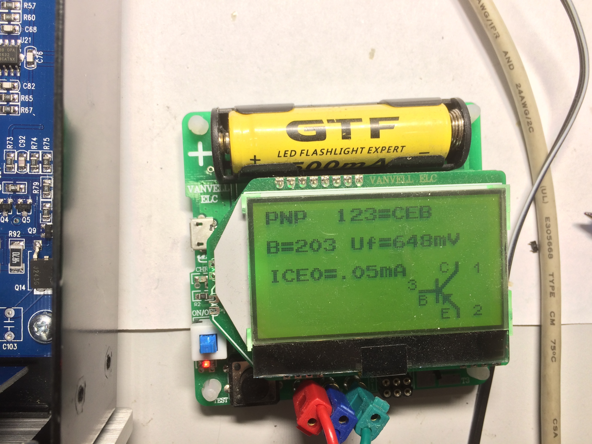
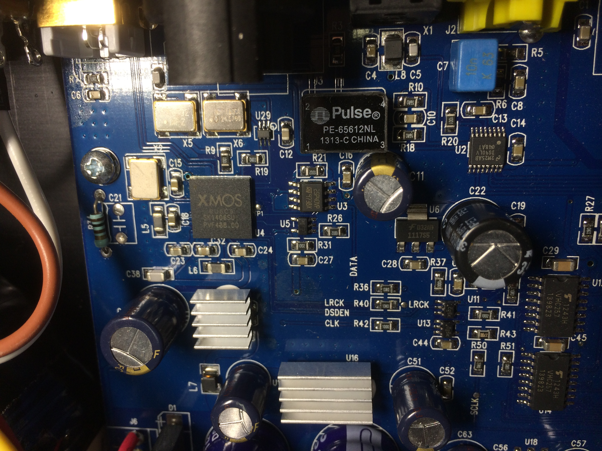

# Yulong d200 headphones amplifier repair guide
We've got Yulong D200 with broken headphones amplifier.

It have [class B](https://en.wikipedia.org/wiki/Push%E2%80%93pull_output) power amplifier stage on matched pair of [MJD243](doc/MJD243-D.PDF) with negative feedback from output to [OP275](doc/OP275.pdf) inverting input.

Spending some time on reverse-engineering the output stage schematics we came to the following picture. It might be not quite exact and a bit dirty, but it gives a picture of the actual output stage schematics.

I was unable to determine the exact type of transistors in preamp stage, but got its characteristics, by measuring it on working channel.

Q2=Q7=Q9=Q4 are bipolar NPN transistors, which have the following characteristics

Q3=Q6=Q8=Q5 are bipolar PNP transistors, which have the following characteristics

Finaly I ended up by replacing Q2 with [BC847B](doc/BC847_SER.pdf) and R84 with 27 Ohm resistor.

## Yulong images

## More info about yulong products

http://www.qobuz.com/gb-en/info/hi-res-guide/yulong-sabre-da8ii-solid177720

https://hi-news.ru/audio/obzor-capa-i-usilitelya-dlya-naushnikov-yulong-d200.html
